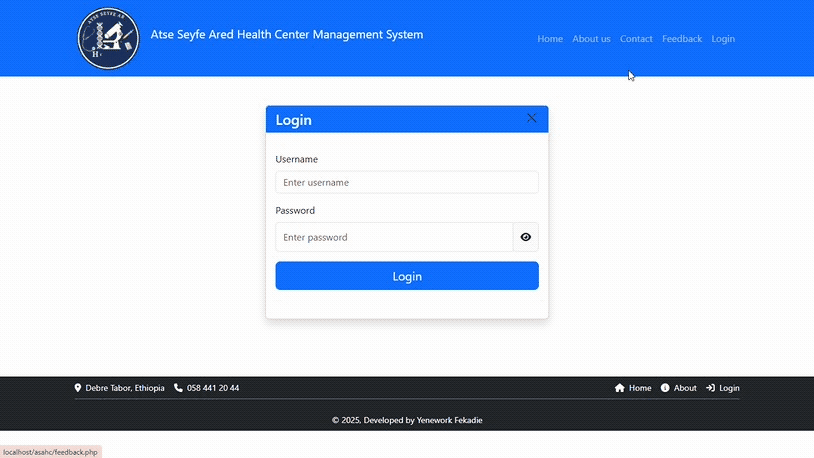
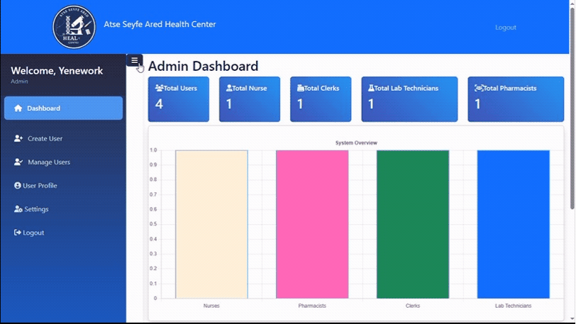
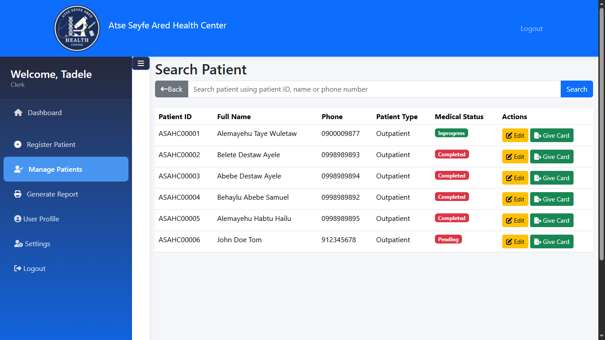
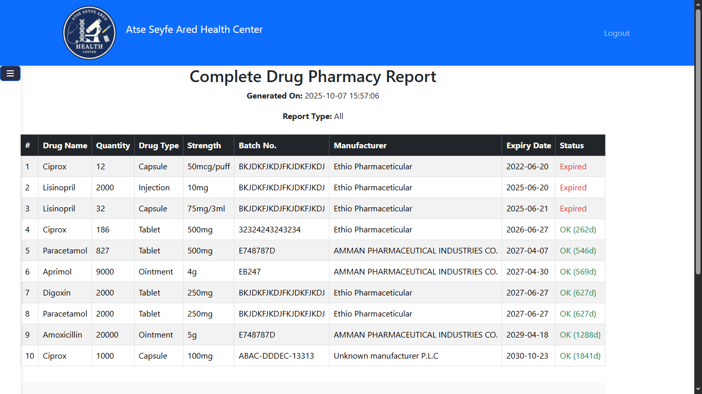
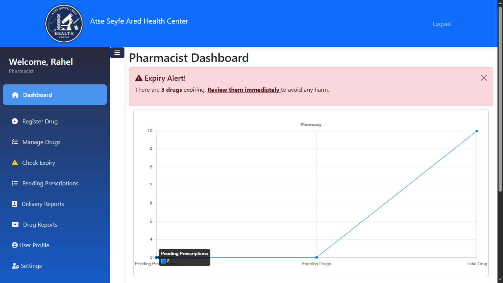
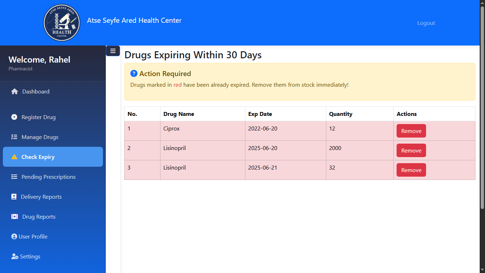
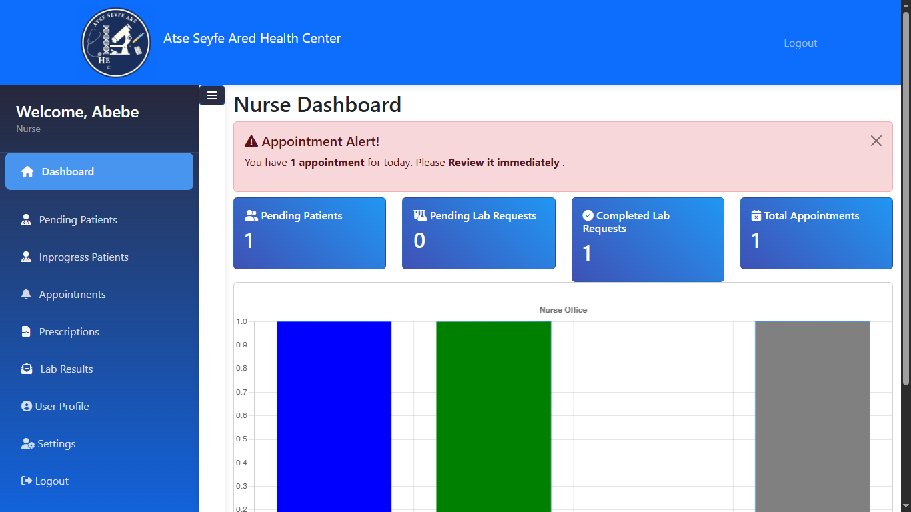

# 🏥 Web-Based Health Center Management System
A modern, web-based application designed to streamline and manage the daily operations of a health center. This system facilitates the management of patient records, appointments, staff scheduling, improving overall efficiency and patient care.
# ✨ Features
-  Patient Management: Register new patients, view their medical history, and manage their personal details.
-  Appointment Scheduling: A dynamic calendar for booking, managing, and rescheduling appointments for patients.
-  Staff Management: Secure access for different staff roles (e.g., admin, doctors, nurses) with varying permissions.
-  Billing and Invoicing: Automated billing system to generate and track patient invoices.
-  Electronic Medical Records (EMR): A digital system for secure and organized storage of patient medical data and records.
-  Intuitive Dashboard: A clear, at-a-glance view of daily schedules, patient queues, and key metrics for administrative staff.
-  User Authentication: Secure login system with role-based access control to ensure data privacy.
# 💻 Technologies Used
* Frontend: html, JavaScript.
* Backend: PHP.
* Database: MySQL.
* Styling:  CSS, Bootstrap.
* Deployment: Xampp.

# 🛠️ Installation and Setup
Please note: This repository contains a partial upload of the project for demonstration purposes. It showcases the foundational structure and key features but does not include the full source code.
To obtain the complete source code, please contact me directly via:
* Email: tefekadie@gmail.com
* Linkedin: www.linkedin.com/in/yenework-fekadie

# 🖼️ Screenshots
Home page
# 
Login page
# 
Admin Dashboard
# 
Patient Management
# 
Drug Reporting
# 
Pharmacist Dashboard
# 
Drug Expiry Checking
# 
Nurse Dashboard
# 
<!-- #  -->

# 🤝 Contributing
Contributions are always welcome! If you have suggestions for new features, find a bug, or want to improve the code, please feel free to create an issue or submit a pull request.
# 📜 License

This project is licensed under the MIT License.

